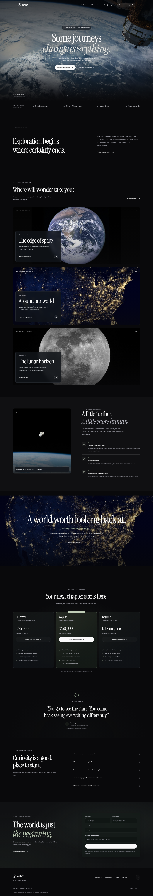

# Orbit — Next.js App Router + shadcn/ui

A premium cinematic landing-page template by [Junno UI](https://junno-ui.com/). Built for travel, experience, hospitality, and aspirational brands. Copyright © 2026 Junno UI.



## Features

- Responsive hero adapted from the supplied reference, destination collection, experience block, pricing, story, FAQ, enquiry, and footer.
- Instrument Serif + Inter, a dark zinc token system, local photography, and local fonts.
- Motion-powered one-time section reveals, CSS entrance sequencing, hover feedback, and live reduced-motion support. Content remains visible when animation is unavailable.
- Lenis wheel and anchor scrolling, native touch behavior, and automatic suspension for reduced motion, hidden tabs, and the mobile Sheet.
- Frosted navigation, destination lenses, and an enquiry panel; spring-driven card highlights, button sheen, press feedback, and staggered reveals. Reduced transparency switches to solid surfaces.
- Official shadcn/ui Button, Badge, Card, Input, Textarea, Label, Native Select, Accordion, and Sheet, styled for Orbit.
- Focus-managed mobile navigation with Escape handling, keyboard-operable FAQs, visible focus, labelled fields, and browser validation.
- Typed content separated from layout, sections, and UI primitives.
- SEO/social metadata, favicon suite, manifest, robots, sitemap, and a designed 404 view.
- Commercial license, third-party notices, deployment notes, and automated browser checks.

## Folder structure

```text
src/app/             App Router, root metadata and route layout
src/components/blocks/   Landing-page sections
src/components/layout/   Header and footer
src/components/ui/       Reusable primitives and hero
src/assets/data/   Typed page content
src/config/site.ts   Site identity and contact details
src/app/globals.css   Fonts and design tokens
public/              Images, icons, and metadata assets
docs/                Deployment and customization notes
tests/               Browser behavior and accessibility checks
```

This is a single standalone Next.js template, rooted directly in `template/orbit`. Routes use the App Router under `src/app`; there is no Pages Router or separate framework edition. The `(pages)` route group only organizes the landing page and its layout.

`@/components/ui` maps to `src/components/ui`, where the actual shadcn/ui sources live. `components.json` configures the CLI, and `src/lib/utils.ts` provides `cn`. Add components with `npx shadcn@latest add <component>`. Orbit customizes the Button variants, Sheet touch targets, and Accordion icon; review changes before using `--overwrite`. Semantic Tailwind tokens in `globals.css` support additional shadcn components.

Pages and static sections are Server Components. Client boundaries cover the Sheet, Accordion, enquiry form, and motion provider. Content and site settings remain separate from the components.

## Installation

Use Node.js 22.12+ and npm. From `template/orbit`, run:

```sh
npm ci
cp .env.example .env
npm run dev
```

PowerShell: use Copy-Item .env.example .env. If PowerShell blocks npm.ps1, run npm.cmd instead. No API keys, external services, or parent monorepo are required.

## Development commands

- npm run dev — local development
- npm run build — production build
- npm run start — serve the production output
- npm run type-check — framework and TypeScript checks
- npm run lint — ESLint
- npm run format / npm run format:check — Prettier
- npx playwright install chromium — one-time browser setup
- npm run test:e2e — desktop, mobile, reduced-motion, keyboard, form, and accessibility checks

Set TEST_BASE_URL to test an already running production server. The default test port is 3100.

## Environment variables

NEXT_PUBLIC_SITE_URL is the public canonical origin. It is safe to expose, and must be an absolute HTTPS URL for production. Copy .env.example, change the origin, and rebuild. Never put secrets into public environment variables.

## Customization

1. Change identity, description, email, and publisher attribution in src/config/site.ts.
2. Edit the section data in src/assets/data/; components contain structure rather than business copy.
3. Change color, font, radius, and motion tokens in src/app/globals.css. Dark-only is intentional for this art direction.
4. Replace local assets in public/images/hero and public/images/features. Retain third-party notices for assets you keep. Update metadata artwork, favicon files, and manifest when rebranding.
5. Update site config and public origin to update route metadata. Review all sample copy before release.

Motion tuning: `src/components/providers/smooth-scroll.tsx` configures Lenis (lerp 0.09); `src/lib/reveal.ts` handles one-time entrances and 80ms card staggering. `src/components/ui/interactive-card.tsx` adds pointer-only light with Motion springs. Glass tokens and the material/interaction styles are at the end of `src/app/globals.css`. The navbar is fixed; `scroll-padding-top: 112px` keeps anchor headings visible. There are no perpetual decorative animation loops or animated blur filters.

Scrolling: the header's 64px sentinel changes its transparent surface into glass using IntersectionObserver. `src/components/ui/scroll-story.tsx` observes the experience chapters; their copy and images live in `src/assets/data/features.ts`. The visual sticks at 140px on viewports at least 900px wide and 700px tall. Mobile, short viewports, JavaScript-disabled browsers, and reduced-motion users get a compact static layout. Preference changes are handled immediately. The hero exit and thin reading indicator use native CSS scroll timelines; unsupported browsers keep the static hero and omit the indicator. Adjust `--motion-fast`, `--motion-medium`, and `--motion-slow` in the stylesheet for interaction, crossfade, and entrance timing. Reveals use 650ms and run once per page load.

The enquiry form is deliberately frontend-only: it validates details, creates a visible draft, then offers a mailto link. It never claims an email was sent or a booking was completed. Replace the email address (hello@example.com) before publishing. For automated submissions, connect a server endpoint with server-side validation, abuse prevention, and explicit pending/error/success states. Do not put credentials into client code.

## Deployment

### React Bits scroll scenes

The landing page uses four typed adaptations in `src/components/motion`: `ScrollFloat` (destination heading), `ScrollReveal` (editorial introduction), `ScrollStack` (destination collection), and `ScrollExpand` (cinematic break). Their shared stylesheet is `scroll-effects.css`; editorial copy lives in `src/assets/data/editorial.ts`.

`src/lib/scroll-motion.ts` registers GSAP/ScrollTrigger and scopes setup and cleanup to each component after fonts load. Lenis is driven by GSAP's ticker; do not enable `autoRaf` or create another Lenis instance inside a section. Effects activate at 900px width and 700px height with no reduced-motion preference. Smaller viewports, reduced motion, and JavaScript-disabled browsing show the full static content. Changing the system preference immediately restores readable untransformed content.

`ScrollFloat` and `ScrollReveal` retain the supplied text animation props, with word-aware line wrapping and a single accessible text representation. Orbit uses restrained easing and disables word blur. `ScrollStack` is a document-scroll adaptation: `stackPosition` is pixels, with native sticky positioning and GSAP scale, and no nested-scroller, rotation, or blur options. `ScrollExpand` supports images on document scroll; it omits the supplied internal-scroller and autoplay-video modes. Its clip-path reveal has a short 0.65-viewport expansion and 0.12-viewport hold. Both have static defaults, scoped cleanup, and no component-owned animation-frame loops.

React Bits' Commons Clause restricts redistribution of the components themselves. **Resolve the source redistribution rights before selling this template.** See [THIRD_PARTY_NOTICES.md](THIRD_PARTY_NOTICES.md) and the [included license](docs/licenses/react-bits.txt). The Junno UI commercial license does not grant rights to third-party components.

See [docs/DEPLOYMENT.md](docs/DEPLOYMENT.md). Run npm run build and npm start, or deploy to a Next.js-compatible provider.

## Credits

Design direction: requester-supplied responsive hero and dark zinc/Instrument Serif system. UI: shadcn/ui and Radix UI. Photography: Unsplash. Icons: Lucide. Fonts: Inter and Instrument Serif via Fontsource (self-hosted Latin subsets; change imports for other languages). Motion: Motion library. See [THIRD_PARTY_NOTICES.md](THIRD_PARTY_NOTICES.md) for sources and license boundaries.

## License and support

Commercial license; not MIT. Personal and client end products are allowed according to the purchased tier. Template redistribution and marketplace resale are prohibited. See [LICENSE.md](LICENSE.md). Before marketplace release, confirm the rights to redistribute the customer-supplied hero reference and finalize purchase-tier/refund policy presentation.

For support or custom work, visit [Junno UI](https://junno-ui.com/), documentation.html, or hire-us.html. Orbit is a fictional brand; sample pricing and stories are not real offers or endorsements.
